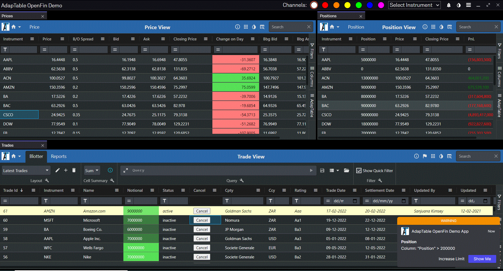
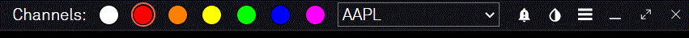
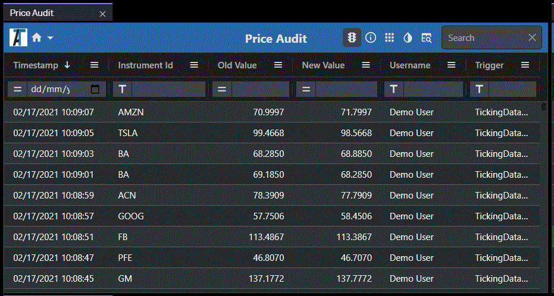
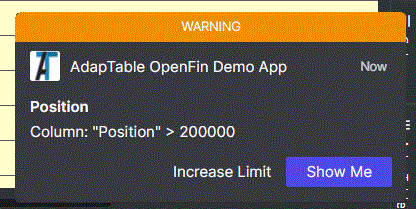
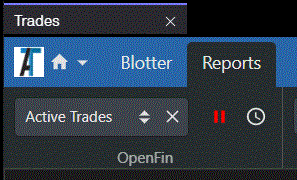
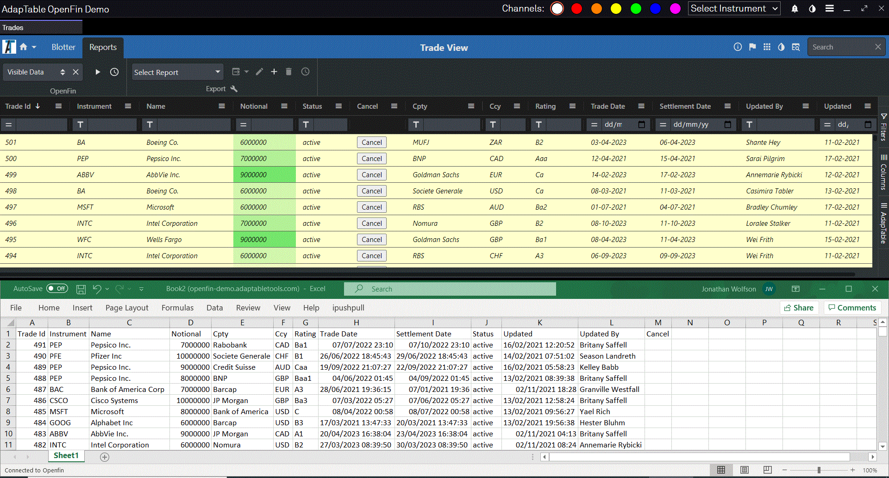

# AdapTable OpenFin Demo



## Overview

This demo application illustrates how [Adaptable](https://adaptabletools.com) and [OpenFin](https://openfin.co/) combine neatly together to offer powerful, cutting-edge, functionality that can be used to create feature-rich financial applications.
      
It uses **dummy data** to mimic the types of screens, workflows and advanced use-cases typically found in Financial Services systems.

> The demo application is not designed to be used 'off the shelf' but as an example of the functionality offered by AdapTable and OpenFin, and how they can be used in tandem to produce cutting-edge applications with advanced features like live 2-way excel exports, notifications, cross-widget communicatino and many other benefits.
        
The demo took less than a day to develop and uses just a small subset of the many, exceptional features found in both AdapTable and OpenFin.

## How it Works
       
The demo - built using AdapTable's [OpenFin Plugin](https://docs.adaptabletools.com/docs/plugins/openfin/openfin-plugin) - displays a pseudo Front Office set-up with 3 views: *Trade*, *Price* & *Positions*.

Each blotter is an OpenFin application which shows 'ticking' data, and each updates in real time as a result of external ticking data updates and data changes made in the other screens.

The demo also includes 2 Audit windows - Trade and Price - which show all the grid-related activity in the respective blotters.
        
> All 5 screens are OpenFin windows so they can be dragged, tiled and grouped as each user prefers.

### Blotters 
The 3 blotters in the demo application are:

**1. Trade Blotter**
- Displays a collection of fictitous Trades (25 at startup), each of which has an *InstrumentId* and a *Status* (of active or inactive)
- Every 10 seconds a new trade is added to the dummy data and displayed in the Grid
- Editable columns are: *Status* and *Notional*

**2. Price Blotter**
- Displays a made-up list of *Instruments*, each of which contains a Price
- Every few seconds the Price is updated (and flashes accordingly)
- Each row also contains a *Closing Price*, *Spread* and *Bid* and *Ask*
- Editable columns are: *Price*, *BidOfferSpread* 

**3. Positions Blotter**
- Displays the position for each *InstrumentId* based on data from the Trade and Price screens
- Each row aggregates all the trades for an <i>InstrumentId</i> and calculates the PnL based on the current Price
- Each time a Trade is added or a Price changes, the Positions Blotter will update (via the OpenFin xxx)
- No columns are editable

### Application Bar
At the top of the demo are a series of useful buttons and dropdowns which help to manage, and sync data between, the various windows.  It includes:

- **Channel Chooser** - allows the user to pick the (coloured) [OpenFin Channel](https://developers.openfin.co/docs/channels) on which FDC3 messages will be broadcast

- **Instrument Picker**: Selecting an Instrument from the dropdown does 2 things:
  1. broadcasts an [FDC3](https://fdc3.finos.org/) message on the current channel providing details of the selected instrument; this allows 3rd party applications running in OpenFin to react accordingly
  2. sends a message via the [OpenFin IAB](https://developers.openfin.co/docs/introduction) (Inter-Application Message Bus); this is intercepted by each of the 3 blotters which then filter to show only rows containing that Instrument 

- **Theme Button** - toggles the [Adaptable Theme](https://docs.adaptabletools.com/docs/adaptable-functions/theme-function) in all the Blotters between white and dark themes.

    > The same effect can be achieved by changing the theme in any of the individual Blotters

- **Pause/Display Button** - sets whether OpenFin Notifications wil appear

- **Hide/Show Butto** - toggles Sidebar visibility



### Audit Screens
The Demo leverages the powerful [AdapTable Audit Log](https://docs.adaptabletools.com/docs/key-topics/audit-log) to provide a live 'view' of all data changes. 
 
There are 2 Audit Screens - each of which listens to the Audit Log stream and outputs the data directly to an AdapTable instance:
- **Trade Audit**: Displays a list of all Cell Edits made in the Trade Blotter - who made the change, what was changed and when
- **Price Blotter**: Displays a list of all Cell Edits made in the Price Blotter and also logs all Ticking Data changes



###  Sidebar 
A sidebar is displayed on the left of the application giving access to all the screens available in the demo

> This can be hidden / displayed via a button in the Application Toolbar

## Notifications and Alerts
The Positions Blotter has been set up to fire an [Adaptable Alert](https://docs.adaptabletools.com/docs/adaptable-functions/alert-function) when any Position is greater than 70,000.

The Alert has been configured with the *ShowInOpenFin* property set to true (something only available when running in the OpenFin container).

The result is that, when triggered, the Alert is displayed as an [OpenFin Notification](https://www.npmjs.com/package/openfin-notifications) and appears at the side of the grid.

The Notification has been designed with 2 [action buttons](https://cdn.openfin.co/docs/services/notifications/stable/api/modules/actions.html). In each case the demo app handles the button click event and accesses the AdapTable API to peform a relevant task:
- **Increase Limit**: adds 1,000 to the Position amount that, when exceeded, triggeres the Alert. (Note how after clicking this button, next time the Alert fires it shows the updated limit as its trigger.)

- **Show Me**: highlights the Cell that triggered the Alert and also make the grid 'jump' to show that cell if it was not already in view.



## Live Export
AdapTable ships with many compelling, extra features, only available when it is running in the OpenFin container.

One of these is 2-way Live Export - whereby grid data can be sent from AdapTable to Excel with the following features:



- Excel will automatically update in line with cell edits and ticking data changes in AdapTable

- Any date edits made directly in Excel will be automatically reflected in AdapTable
  
- Any [Cell Validation Rules](https://docs.adaptabletools.com/docs/adaptable-functions/cell-validation-function) created in AdapTable will be invoked when data in Excel is edited which breaks a rule.  
  
  > When that happens an OpenFin Notification will popup giving details of the validation rule and an Action Button to undo the edit

This is activated by selecting a report from the **OpenFin Toolbar** in the Trades [Dashboard](https://docs.adaptabletools.com/docs/user-interface/dashboard) and running Live Update (the play buttton).

> Note: you must have Excel open **before** you run Live Export
       


## AdapTable Features

There are numerous [AdapTable Functions](https://docs.adaptabletools.com/docs/adaptable-functions/adaptable-functions-overview) being used in this demo to enhance the workflow and improve the user experience.
> For this demo, these have been configured as JSON at design-time through [Predefined Config](https://docs.adaptabletools.com/docs/predefined-config/predefined-config-overview), but they can, instead, be created at run-time via the AdapTable UI (or programmatically through the [Adaptable API](https://docs.adaptabletools.com/docs/adaptable-api/adaptable-api-overview)).

The AdapTable Functions being used in this demo include: 
### Dashboard
The AdapTable [Dashboard](https://docs.adaptabletools.com/docs/user-interface/dashboard) has been set up as follows in the various blotters:
- *Trades View* - has 2 Tabs - *Blotter* and *Reports* (each with own set of Toolbars)
- *Position View* & *Price View* - a single Tab with a different set of Toolbars
- *Position View* & *Price View* - configued so Dashboard is in 'Collapsed' mode at startup

### Layout
There are a number of Layouts configured for the demo:
- *Trades View* contains 2 [Layouts](https://docs.adaptabletools.com/docs/adaptable-functions/layout-function) :
  1. *Latest Trades* - shows all Columns ordered by *TradeId* in descending order
  2. *Counterparties* - shows a subset of Columns grouped by *Counterparty* (and with *Notional* aggregated)

- *Price View* contains a single Layout called Price - this includes all 3 [Calculated Columns](https://docs.adaptabletools.com/docs/adaptable-functions/calculated-column-function) created for that view.

### Alert
An [Alert](https://docs.adaptabletools.com/docs/adaptable-functions/alert-function) (of type 'Warning') has been configured in *Position View* to fire when Position Coumn value > 70,000 - will trigger an OpenFin Notification

### Conditional Style
The following [Conditional Styles](https://docs.adaptabletools.com/docs/adaptable-functions/conditional-style-function) have been set up:
  - *Trades View* - Styles the whole Row light yellow where *Status* column value is 'active'
  - *Price View* - 2 Styles for 'Change of Day' column: green background for positive values and red background for negative values
  - *Position View* - 'PnL' column displays a green / red font for positive / negative numbers

### Calculated Column
3 [Calculated Columns](https://docs.adaptabletools.com/docs/adaptable-functions/calculated-column-function) have been configured in *Price View*:
  - **Bid**: Created with Expression: ```'[price] - [bidOfferSpread] / 2'```
  - **Ask**: Created with Expression: ```'[price] + [bidOfferSpread] / 2' ```
  - **Change on Day**: Created with Expression: ```'[price] - [closingPrice]'```
                  
### Format Column
All the views have [Format Columns](https://docs.adaptabletools.com/docs/adaptable-functions/format-column-function) configured:
- *Trades View*: All Date Columns (Trade Date, Settlement Date, LastUpdated) use a Date Format of 'MM/DD/YYYY'
- *Price View*: 'Bid', 'Ask', 'Change On Day', 'Price' have Display Format of 4 dp and right cell alignment
- *Position View*: 'Current Price', 'Closing Price' have Display Format of 4 dp; 'PnL' has negative numbers in parentheses

### Gradient Column
The *Notional* column in *Trades View* has a [Gradient Column](https://docs.adaptabletools.com/docs/adaptable-functions/gradient-column-function) applied using a light green background.

### Flashing Cell
These [Flashing Cell](https://docs.adaptabletools.com/docs/adaptable-functions/flashing-cell-function) columns have been configured:
  - *Price View*: 'Bid', 'Ask', and 'Price' all have Flashing Cells set (to Green and Red)
  - *Position View*: 'Position' has Flashing Cells set (to Green and Red)

### Plus Minus
*Price View* contains 2 [Plus / Minus Rules](https://docs.adaptabletools.com/docs/adaptable-functions/plus-minus-function) for the 'Bid Offer Spread' column:
  - Default Nudge value of 0.5 - how cells in Column will increment / decrement when the '+' or '-' keys are pressed
  - A Custom Plus Minus Rule which specifies that if the *InstrumentId* is 'AAPL', the cell will nudge instead by 1
  


### Export
*Trades View* contains an 'Active Trades' Report for [Export](https://docs.adaptabletools.com/docs/adaptable-functions/export-function) which;
  - includes All Columns and any Rows where Status is 'Active'
  - is also available in the OpenFin Toolbar and so can be exported to Excel as a "Live Report (which will update in real time)

### Cell Validation
A [Cell Validation Rule](https://docs.adaptabletools.com/docs/adaptable-functions/cell-validation-function) has been added to the *Trades* view that the 'Notional' column cannot be negative.

### EditLookUp 
An [Edit Lookup](https://docs.adaptabletools.com/docs/predefined-config/user-interface-config#editlookupitems) Item has been added to *Status* column in *Trades View* to enable quick editing

### Query
A [Shared Query](https://docs.adaptabletools.com/docs/adaptable-functions/query-function) called "Active US Trades" has been supplied for *Trades View* to show active to show active trades for some counterparties.  The Expression it uses is:
```
'[status]="active" AND [counterparty] IN ("Goldman Sachs","Bank of America","JP Morgan","Morgan Stanley")'
```      
              
### Action Column
An [Action Column](https://docs.adaptabletools.com/docs/adaptable-functions/action-column-function) has been added to the *Trades View* which displays a 'Cancel' button in any row where Status is 'active'.  When clicked it changes the Status to 'inactive'.

### User Menu Items 
All 3 views have 2 menu items which when clicked will broadcast the Instrument via an [FDC3](https://fdc3.finos.org/) message (using current channel):
- *Broadcast* [Context Menu](https://docs.adaptabletools.com/docs/user-interface/context-menu) Item which appears only when right-clicking in a cell in Instrument
- *Broadcast* [Column Menu](https://docs.adaptabletools.com/docs/user-interface/column-menu/) Item which appears only in Instrument Column Menu

The *Trades View* has a *Cancel* Context Menu Item which appears in all rows where *Status* is 'active'.  When the menu item is selected the *Status* changes to 'inactive'.


## Installation

NOTE: In order to be able to run `npm install`, you need first to be logged into our private NPM registry - follow the instructions in the [Adaptable Documentation](https://docs.adaptabletools.com/docs/getting-started/installationn)

> If you do not have an Adpatable Login please contact support@adaptabletools.com

Run `npm install` (or `yarn`), depending on what tool you're using.

## Running in production

If you want to run the live app just run the command below on a Windows machine

```sh
$ npx openfin-cli --launch --config https://openfin-demo.adaptabletools.com/openfin-app.json
```

This will launch the OpenFin runtime and open the AdapTable demo for you.

### Running in dev

To run the demo in development mode run these 2 commands:

```sh
$  npm run dev
$  npm run dev-openfin
```

## Licences
A licence for AdapTable provides access to all product features as well as quarterly updates and enhancements through the lifetime of the licence, comprehensive support, and access to all 3rd party libraries.

Licences can be purchased individually, for a team, for an organisation or for integration into software for onward sale.

We can make a trial licence available for a short period of time to allow you to try out AdapTable for yourself.

Please contact [`sales@adaptabletools.com`](mailto:sales@adaptabletools.com) for more information.

## More Information

- For general information about Adaptable Tools is available at our [Website](http://www.adaptabletools.com) 

- To see AdapTable in action visit our [Demo Site](https://demo.adaptabletools.com) which contains large number of AdapTable demos each showing a different feature, function or option in AdapTable (using dummy data sets).

- Developers can learn how to access AdapTable programmatically at [AdapTable Documentation](https://docs.adaptabletools.com).

- For all support enquiries please email [`support@adaptabletools.com`](mailto:support@adaptabletools.com) or [raise a Support Ticket](https://adaptabletools.zendesk.com/hc/en-us/requests/new).
