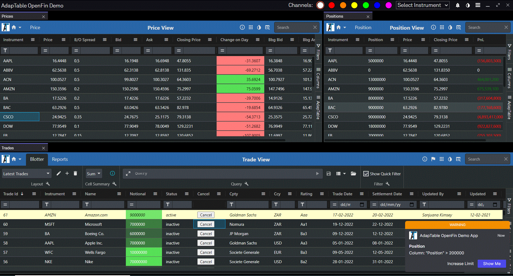

# AdapTable OpenFin Demo




## Overview

This demo application illustrates how [Adaptable](https://adaptabletools.com) and [OpenFin](https://openfin.co/) combine neatly together to provide powerful, cutting-edge, feature-rich applications.
      
It uses **dummy data** to mimic the types of screens, workflows and advanced use-cases typically found in Financial Services systems.
        
The application took less than a day to develop and uses a small subset of the many, exceptional features found in both AdapTable and OpenFin.

## How it Works
       
The Demo Application - built using AdapTable's [OpenFin Plugin](https://docs.adaptabletools.com/docs/plugins/openfin/openfin-plugin) - displays a pseudo Front Office set-up with 3 views: Trade, Price and Positions.
        
Each screen is an OpenFin application which shows 'ticking' data, and each updates based on data changes in the other screens:

### 1. Trade Blotter
- Displays a collection of fictitous Trades (25 at startup), each of which has an *InstrumentId*
- Every 10 seconds a new trade is added to the dummy data and displayed in the Grid
- Editable columns are: Trade Status, Notional (is this correct?)

### 2. Price Blotter
- Displays a made-up list of *Instruments*, each of which contains a Price
- Every x seconds the Price is updated (and flashes accordingly)
- Each entry also contains a Closing Price, Spread and Bid and Ask
- Editable columns are: Price, BidOfferSpread (is this correct?)
### 3. Positions Blotter<
- Displays the position for each *InstrumentId* based on data from the Trade and Price screens
- Each row aggregates all the trades for an <i>InstrumentId</i> and calculates the PnL based on the current Price
- Each time a Trade is added or a Price changes, the Positions Blotter will update (via the OpenFin xxx)
- No columns are editable

### Keeping in Sync
One essential feature in the Demo is that all 3 Blotters can stay in sync with each other by using OpenFin communication APIs.

This happens in various ways in the demo app:</p>
- **Set the Filter** on the *InstrumentId* Column in any Blotter will cause the other Blotters to filter immediately on same instrument
- **Clear the Filter** on the *InstrumentId* Column in any Blotter will clear the Filters for that Column in all screens
- **Changing the Theme** in one screen will update the theme in all (also possible via the buttons at top of application)

## Audit Screens
The Demo leverages the powerful [AdapTable Audit Log](https://docs.adaptabletools.com/docs/key-topics/audit-log) to provide a live 'view' of all data changes. 
 
There are 2 Audit Screens - each of which listens to the Audit Log stream and outputs to a new window:
- **Trade Audit**: Displays a list of all Cell Edits made in the Trade Blotter - who made the change, what was changed and when
- **Price Blotter**: Displays a list of all Cell Edits made in the Price Blotter but also logs Ticking Data changes

## OpenFin Channels
Need a few sentences on how the apps talk to each other

## Notifications and Alerts
The Positions Blotter has been set up to fire an [Adaptable Alert](https://docs.adaptabletools.com/docs/adaptable-functions/alert-function) when any Position is greater than 50,000.

The Alert has been configured with the *ShowInOpenFin* property set to true (something only available when running in the OpenFin container).

The result is that the Alert is displayed as an [OpenFin Notification](https://www.npmjs.com/package/openfin-notifications) and appears at the side of the grid when triggered.

The Notification has been designed with 2 buttons. In each case we
          handle the button click event and all the AdapTable API to peform a
          connected action:
        </p>
        <ol>
          <li>
            <b>Increase Limit: </b>
            This will add 1,000 to the amount that the Position must be before
            it is triggered. (Note how after clicking this button, next time the
            Alert fires it shows the updated limit as its trigger.)
          </li>
          <li>
            <b>Show Me: </b>
            This will highlight the Cell that triggered the Alert and also make
            the grid 'jump' to show that cell if it was not already in view.{" "}
          </li>
        </ol>
        <a id="live-export"></a>
        <h3>Live Export</h3>
        <p>
          AdapTable ships with compelling, extra features, only available when
          it is running in the OpenFin container.
        </p>
        <p>
          One of these is Live Export - whereby grid data can be sent from
          AdapTable to Excel with 2 way updates:
        </p>
        <ul>
          <li>
            Excel will automatically update in line with cell edits and ticking
            data changes in AdapTable
          </li>
          <li>
            Any date edits made directly in Excel will be automatically
            reflected in AdapTable
          </li>
        </ul>
        <p>
          This can be achieved by selecting a report from the{" "}
          <b>OpenFin Toolbar</b> in the Trades{" "}
          <a
            href="https://docs.adaptabletools.com/docs/user-interface/dashboard"
            target="_blank"
          >
            Dashboard
          </a>{" "}
          and running Live Update (the triangular buttton).
        </p>
        <a id="adaptable-features"></a>
        <h3>AdapTable Features</h3>
        <p>
          There are numerous{" "}
          <a
            href="https://docs.adaptabletools.com/docs/adaptable-functions/adaptable-functions-overview"
            target="_blank"
          >
            AdapTable Functions
          </a>{" "}
          being used in this demo application to enhance the workflow and
          improve the user experience.
        </p>
        <p>
          Note: these have been configured at design-time through{" "}
          <a
            href="https://docs.adaptabletools.com/docs/predefined-config/predefined-config-overview"
            target="_blank"
          >
            Predefined Config
          </a>
          , but they can, instead, be created at run-time via the AdapTable UI.
        </p>
        <p>Some of the Functions being used are:</p>
        <ul>
          <li>
            <a
              href="https://docs.adaptabletools.com/docs/user-interface/dashboard"
              target="_blank"
            >
              Dashboard
            </a>
            <ul>
              <li>
                Trade View - Two Tabs - <i>Blotter</i> and <i>Reports</i> (each
                with own set of Toolbars)
              </li>
              <li>
                Position and Price Views - a single Tab with a different set of
                Toolbars
              </li>
              <li>
                Position and Price Views - configued so Dashboard is in
                'Collapsed' mode at startup
              </li>
            </ul>
          </li>
          <li>
            <a
              href="https://docs.adaptabletools.com/docs/adaptable-functions/alert-function"
              target="_blank"
            >
              Alert
            </a>
            <ul>
              <li>
                Position View - will fire an Alert when Position Coumn value is
                greater than 50,000{" "}
              </li>
              <li>
                The Alert is of type 'Warning' and is configured to trigger an
                OpenFin Notification
              </li>
            </ul>
          </li>
          <li>
            <a
              href="https://docs.adaptabletools.com/docs/adaptable-functions/conditional-style-function"
              target="_blank"
            >
              Conditional Style
            </a>
            <ul>
              <li>
                Trade View - Styles the whole Row where Status Column value is
                'active'
              </li>
              <li>
                Price View - 2 Styles for 'Change of Day' Column: green
                background for positive values and red background for negative
                values
              </li>
              <li>
                Position View - 'PnL' Column displays a green or red font for
                positive and negative numbers
              </li>
            </ul>
          </li>
          <li>
            <a
              href="https://docs.adaptabletools.com/docs/adaptable-functions/calculated-column-function"
              target="_blank"
            >
              Calculated Column
            </a>
            <ul>
              <li>
                Price View - contains 3 Calculated Columns:
                <ol>
                  <li>
                    <b>Bid</b>: Created with Expression: '[price] -
                    [bidOfferSpread] / 2'
                  </li>
                  <li>
                    <b>Ask</b>: Created with Expression: '[price] +
                    [bidOfferSpread] / 2'
                  </li>
                  <li>
                    <b>Change on Day</b>: Created with Expression: '[price] -
                    [closingPrice]'
                  </li>
                </ol>
              </li>
            </ul>
          </li>
          <li>
            <a
              href="https://docs.adaptabletools.com/docs/adaptable-functions/format-column-function"
              target="_blank"
            >
              Format Column
            </a>
            <ul>
              <li>
                Trade View: All Date Columns (Trade Date, Settlement Date, Last
                Updated) use a Date Format of 'MM/DD/YYYY'
              </li>
              <li>
                Price View: 'Bid', 'Ask', 'Change On Day', and 'Price' have a
                Display Format of 4 decimal places and cell aligns right
              </li>
              <li>
                Position View: 'Current Price', 'Closing Price' and 'PnL' have
                Display Format of 4 decimal places; 'PnL' also has negative
                numbers in parentheses
              </li>
            </ul>
          </li>
          <li>
            <a
              href="https://docs.adaptabletools.com/docs/adaptable-functions/flashing-cell-function"
              target="_blank"
            >
              Flashing Cell
            </a>
            <ul>
              <li>
                Price View: 'Bid', 'Ask', and 'Price' all have Flashing Cells
                set (to Green and Red)
              </li>
              <li>
                Position View: 'Position' has Flashing Cells set (to Green and
                Red)
              </li>
            </ul>
          </li>
          <li>
            <a
              href="https://docs.adaptabletools.com/docs/adaptable-functions/plus-minus-function"
              target="_blank"
            >
              Plus Minus
            </a>
            <ul>
              <li>
                Price View - contains 2 Plus / Minus Rules for the 'Bid Offer
                Spread' column:
                <ol>
                  <li>
                    Default Nudge value of 0.5 - how cells in Column will
                    increment / decrement when the '+' or '-' keys are pressed
                  </li>
                  <li>
                    A Custom Plus Minus Rule which specifies that if the{" "}
                    <i>InstrumentId</i> is 'AAPL', the cell will nudge instead
                    by 1
                  </li>
                </ol>
              </li>
            </ul>
          </li>
          <li>
            <a
              href="https://docs.adaptabletools.com/docs/adaptable-functions/layout-function"
              target="_blank"
            >
              Layout
            </a>
            <ul>
              <li>
                Trade View - contains 2 Layouts:
                <ol>
                  <li>
                    'Latest Trades' - shows all Columns ordered by Trade Id in
                    descending order
                  </li>
                  <li>
                    'Counterparties' - shows subset of Columns grouped by
                    Counterparty (and with notional aggregated)
                  </li>
                </ol>
              </li>
            </ul>
          </li>
          <li>
            <a
              href="https://docs.adaptabletools.com/docs/adaptable-functions/export-function"
              target="_blank"
            >
              Export
            </a>{" "}
            <ul>
              <li>
                Trade View - contains an 'Active Trades' Report; will export All
                Columns and any Rows where Status is 'Active'
              </li>
              <li>
                This Report is also available in the OpenFin Toolbar and so can
                be exported to Excel as a "Live Report" (which will update in
                real time).
              </li>
            </ul>
          </li>
          <li>
            <a
              href="https://docs.adaptabletools.com/docs/predefined-config/user-interface-config#editlookupitems"
              target="_blank"
            >
              Edit Lookup
            </a>{" "}
            <ul>
              <li>
                Trade View - has Edit LookUp Items for Status column to enable
                quick editing
              </li>
            </ul>
          </li>
          <li>Action Column</li>{" "}
        </ul>
      </div>


## Installation

NOTE: In order to be able to run `npm install`, you need first to be logged into our private NPM registry - follow the instructions in the [Adaptable Documentation](https://docs.adaptabletools.com/docs/getting-started/installationn)

> If you do not have an Adpatable Login please contact support@adaptabletools.com

Run `npm install` (or `yarn`), depending on what tool you're using.

### Running in dev

```sh
$  npm run dev
```

and

```sh
$  npm run dev-openfin
```

## Running in production

If you want to run the live app just run the command below on a Windows machine

```sh
$ npx openfin-cli --launch --config https://openfin-demo.adaptabletools.com/openfin-app.json
```

This will launch the OpenFin runtime and open the AdapTable demo for you.


## Licences
A licence for AdapTable provides access to all product features as well as quarterly updates and enhancements through the lifetime of the licence, comprehensive support, and access to all 3rd party libraries.

Licences can be purchased individually, for a team (minimum 30 end-users), for an organisation or for integration into software for onward sale.

We can make a trial licence available for a short period of time to allow you to try out AdapTable for yourself.

Please contact [`sales@adaptabletools.com`](mailto:sales@adaptabletools.com) for more information.

## More Information

- For general information about Adaptable Tools is available at our [Website](http://www.adaptabletools.com) 

- To see AdapTable in action visit our [Demo Site](https://demo.adaptabletools.com) which contains large number of AdapTable demos each showing a different feature, function or option in AdapTable (using dummy data sets).

- Developers can learn how to access AdapTable programmatically at [AdapTable Documentation](https://docs.adaptabletools.com).

- For all support enquiries please email [`support@adaptabletools.com`](mailto:support@adaptabletools.com) or [raise a Support Ticket](https://adaptabletools.zendesk.com/hc/en-us/requests/new).
